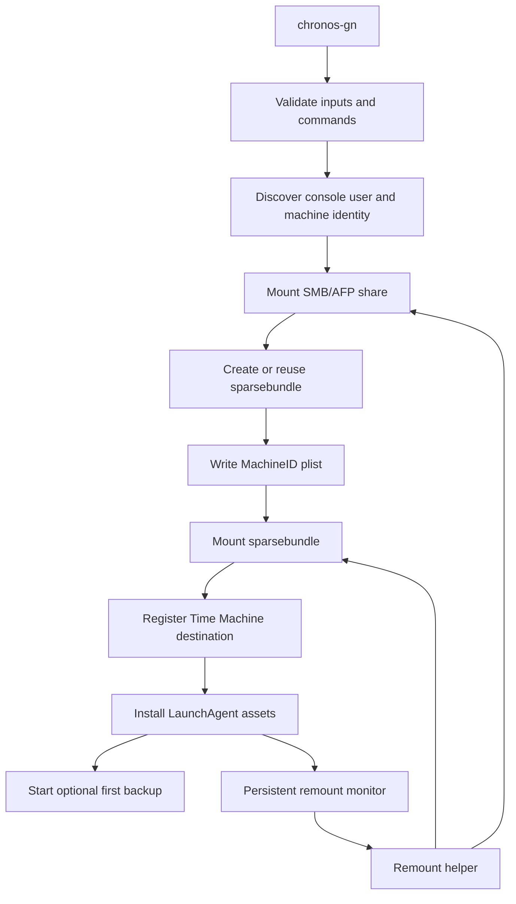

# chronos-gn Architecture

## Purpose

chronos-gn automates macOS Time Machine setup for network-hosted sparsebundles while accounting for macOS-specific behavior around GUI sessions, SMB/AFP mounts, encrypted disk images, and `launchd`.

## Architecture overview

## Main script responsibilities

- Load the config file, then apply CLI arguments over it.
- Validate filesystem, URL, destination path, launch interval, label prefix, and helper directory.
- Discover the logged-in console user and machine identifiers.
- Mount the network share.
- Create or reuse a sparsebundle.
- Write Time Machine machine metadata.
- Mount the sparsebundle image.
- Configure Time Machine with `tmutil setdestination -a`.
- Detect and, with consent, migrate a pre-3.0 `chronos` install.
- Install LaunchAgent, remount helper, and persistent monitor.
- Optionally start the first backup.

## Important runtime state

| Variable | Purpose |
|---|---|
| `CONSOLE_USER` | Actual logged-in macOS GUI user |
| `CONSOLE_UID` | UID used for LaunchAgent bootstrap and `launchctl asuser` |
| `COMPUTER_NAME` | Used in sparsebundle naming and MachineID metadata |
| `HARDWARE_UUID` | Written to Time Machine MachineID plist |
| `PRIMARY_MAC` | Used to generate unique sparsebundle name |
| `BUNDLE_PATH` | Final sparsebundle path on the network share |
| `STAGING_BUNDLE` | Hidden partial copy path used during stage/promote deployment |
| `HELPER_SCRIPT_PATH` | Generated remount helper path |
| `MONITOR_SCRIPT_PATH` | Generated persistent monitor path |
| `LAUNCH_AGENT_PATH` | Per-user LaunchAgent plist path |
| `LABEL_PREFIX` | Reverse-DNS prefix; `LAUNCH_AGENT_LABEL` is `<prefix>.chronos-gn` |
| `HELPER_DIR` | Install location for the generated helper and monitor |
| `CONFIG_FILE` | Config file actually loaded, empty if none |
| `BOOTSTRAP_LOG` | Temporary log buffer used before the final log path is known |

## Why console user context matters

chronos-gn separates root-required tasks from GUI-session-sensitive tasks.

Root is useful for writing helper files, setting ownership, and configuring Time Machine. The logged-in console user context is needed for `open`, DiskImageMounter integration, Keychain prompts, and Aqua-session LaunchAgent behavior.

## Remount architecture

chronos-gn uses a two-part remount model:

1. **Persistent monitor**: long-running LaunchAgent process in the Aqua user session.
2. **Remount helper**: short-lived helper called by the monitor to check and repair share/sparsebundle state.

This design avoids relying solely on `StartInterval`, which was observed to be unreliable in this workflow.

> The annotated script in `legacy/` describes an older `StartInterval`-based flow using short-lived helper execution. That model is superseded and the file is kept only as historical reference.

### Helper behavior

The helper:

- uses a lock directory to prevent duplicate concurrent runs
- checks network host reachability before GUI mount requests
- avoids Finder popups when the SMB/AFP host is offline
- confirms share path and sparsebundle path accessibility
- attempts sparsebundle mount via DiskImageMounter, Launch Services `open`, and `hdiutil attach -agentpass`
- logs final mount state

## Configuration resolution

Settings are resolved once, in this order, before any validation runs:

1. Built-in defaults
2. Config file — first match of `--config PATH`, `$CHRONOS_GN_CONFIG`, `${XDG_CONFIG_HOME:-$HOME/.config}/chronos-gn/config`, `/etc/chronos-gn/config`
3. CLI flags

`preload_config()` scans argv for `--config` before the main flag loop runs, so the file is applied first and flags always win. The file is parsed by a hand-rolled `KEY=value` reader with an allowlist rather than being sourced — it may be read under `sudo`, where sourcing would be arbitrary root code execution.

## Logging model

The final log path depends on the console user's home directory, which is not known until `prepare_context()`. Logging therefore starts against an unpredictable `mktemp` buffer (`init_bootstrap_log`), and `finalize_log_file()` resolves the real path, creates the directory `0700`, and flushes the buffer into it. A log path that is a symlink is refused; a *default* log path inside a world-writable directory is refused unless `--log-file` was passed explicitly.

| Log | Purpose |
|---|---|
| `~/Library/Logs/chronos-gn/chronos-gn.log` | Main setup script log |
| `~/Library/Logs/chronos-gn/chronos-gn-remount.log` | Remount helper log |
| `~/Library/Logs/chronos-gn/chronos-gn-remount-monitor.log` | Persistent monitor log |
| `~/Library/Logs/chronos-gn/chronos-gn-monitor.out` | LaunchAgent stdout |
| `~/Library/Logs/chronos-gn/chronos-gn-monitor.err` | LaunchAgent stderr |

## Design tradeoffs

| Decision | Benefit | Tradeoff |
|---|---|---|
| Use macOS-native mounting | Better Time Machine and Keychain compatibility | More sensitive to user session state |
| Persistent monitor | More reliable reconnect behavior | Long-running user process |
| Stage then promote sparsebundle copy | Safer partial-copy handling | More code and state tracking |
| Encryption enabled by default | Protects backup contents | Requires Keychain/password handling |
| Config file parsed, not sourced | A config file cannot become root code execution | No shell expansion; unknown keys are a hard error |
| Log defaults into the user's home | No predictable path in a world-writable directory | Log location depends on runtime context, so logging starts buffered |
| Migration removes legacy assets only after setup succeeds | A failed run leaves the working old install intact | Consent and execution are split across the run |
| Idempotent reruns | Safer repeated execution | Requires more validation logic |
