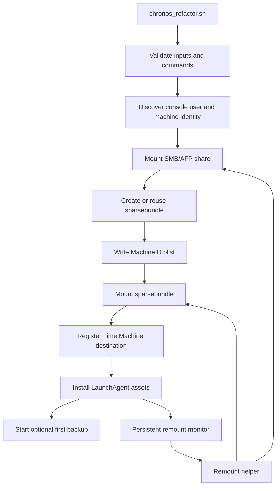

# Chronos Architecture

## Purpose

Chronos automates macOS Time Machine setup for network-hosted sparsebundles while accounting for macOS-specific behavior around GUI sessions, SMB/AFP mounts, encrypted disk images, and `launchd`.

## Architecture overview

## Main script responsibilities

- Parse CLI arguments.
- Validate filesystem, URL, destination path, and launch interval.
- Discover the logged-in console user and machine identifiers.
- Mount the network share.
- Create or reuse a sparsebundle.
- Write Time Machine machine metadata.
- Mount the sparsebundle image.
- Configure Time Machine with `tmutil setdestination -a`.
- Install LaunchAgent, remount helper, and persistent monitor.
- Optionally start the first backup.

## Important runtime state

| Variable | Purpose |
|---|---|
| `CONSOLE_USER` | Actual logged-in macOS GUI user |
| `CONSOLE_UID` | UID used for LaunchAgent bootstrap and `launchctl asuser` |
| `COMPUTER_NAME` | Used in sparsebundle naming and MachineID metadata |
| `HARDWARE_UUID` | Written to Time Machine MachineID plist |
| `PRIMARY_MAC` | Used to generate unique sparsebundle name |
| `BUNDLE_PATH` | Final sparsebundle path on the network share |
| `STAGING_BUNDLE` | Hidden partial copy path used during stage/promote deployment |
| `HELPER_SCRIPT_PATH` | Generated remount helper path |
| `MONITOR_SCRIPT_PATH` | Generated persistent monitor path |
| `LAUNCH_AGENT_PATH` | Per-user LaunchAgent plist path |

## Why console user context matters

Chronos separates root-required tasks from GUI-session-sensitive tasks.

Root is useful for writing helper files, setting ownership, and configuring Time Machine. The logged-in console user context is needed for `open`, DiskImageMounter integration, Keychain prompts, and Aqua-session LaunchAgent behavior.

## Remount architecture in v2.2.1

Chronos v2.2.1 uses a two-part remount model:

1. **Persistent monitor**: long-running LaunchAgent process in the Aqua user session.
2. **Remount helper**: short-lived helper called by the monitor to check and repair share/sparsebundle state.

This design avoids relying solely on `StartInterval`, which was observed to be unreliable in this workflow.

> **v2.1.1 vs v2.2.1:** The older v2.1.1 annotated script described a `StartInterval`-based flow using short-lived helper execution. That model is superseded. All documentation and the annotated script have been updated to reflect the v2.2.1 persistent monitor/remount-helper model.

### Helper behavior

The helper:

- uses a lock directory to prevent duplicate concurrent runs
- checks network host reachability before GUI mount requests
- avoids Finder popups when the SMB/AFP host is offline
- confirms share path and sparsebundle path accessibility
- attempts sparsebundle mount via DiskImageMounter, Launch Services `open`, and `hdiutil attach -agentpass`
- logs final mount state

## Logging model

| Log | Purpose |
|---|---|
| `/tmp/chronos.log` | Main setup script log |
| `~/Library/Logs/Chronos/chronos-remount.log` | Remount helper log |
| `~/Library/Logs/Chronos/chronos-remount-monitor.log` | Persistent monitor log |
| `~/Library/Logs/Chronos/chronos-monitor.out` | LaunchAgent stdout |
| `~/Library/Logs/Chronos/chronos-monitor.err` | LaunchAgent stderr |

## Design tradeoffs

| Decision | Benefit | Tradeoff |
|---|---|---|
| Use macOS-native mounting | Better Time Machine and Keychain compatibility | More sensitive to user session state |
| Persistent monitor | More reliable reconnect behavior | Long-running user process |
| Stage then promote sparsebundle copy | Safer partial-copy handling | More code and state tracking |
| Encryption enabled by default | Protects backup contents | Requires Keychain/password handling |
| Idempotent reruns | Safer repeated execution | Requires more validation logic |
